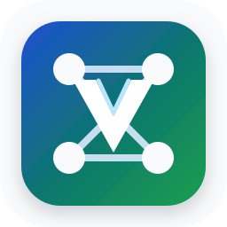
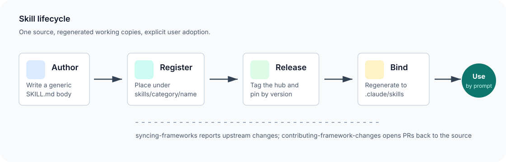
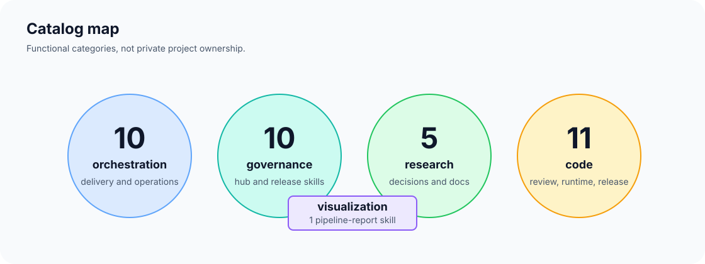
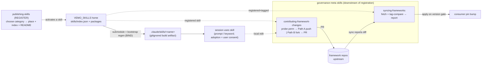

<p align="center">
  <a href="README_zh.md">🇨🇳 中文</a> | <strong>🇬🇧 English</strong>
</p>

<p align="center">
  
</p>

<h1 align="center">VEMO_SKILLS · Shared Skill Home</h1>

<p align="center">
  <strong>A public, reusable skill hub for agent workflows — clone it, bind it, use it by prompt.</strong>
</p>

<p align="center">
  <a href="LICENSE"></a>
  <a href="VERSION"></a>
  <a href="skills"></a>
  <a href="eval/out/report.json"></a>
  <a href="CHANGELOG.md"></a>
</p>

<p align="center">
  
</p>

## First Principles — what this home is *for*

**What it prevents.** Skill **rot in two directions**: copies drifting from their source, and project-specific values
leaking into a shared body. VEMO_SKILLS exists so a skill has **one source** that regenerated copies cannot diverge from,
and **zero project facts** live in the generic body.

**Which principles it lands** (this home is a **shared mechanism**, not a gate-bearing or ledger-owning framework — so
two of the ecosystem's axioms are **n/a** here; see Framework 0 `charter_spec`):
- **Generic / instance decoupling (A3 — primary)** — skill bodies + generic rules live here once; **zero hardcoded
  project values** (ids/paths/chat/language live in the consumer's instance, read at runtime); a body embedding project
  values is a **decoupling gap** the identity-decoupling self-check flags. This is the axiom this home exists to uphold.
- **Human owns adoption (A4)** — a skill is **never** adopted into a toolset without explicit user consent; publishing
  is gated (`skill_spec` §6 — the rule lives in Framework 0; this home implements the publish mechanism).
- **Evidence over assertion (A1) — n/a:** this home **bears no acceptance gate of its own**; a skill's correctness is
  verified where it is *used*, at the consuming project's Framework 0 gates, not here.
- **Truth in the ledger (A2) — n/a:** this home keeps **no task ledger / continuity state** of its own; its durable
  record is its versioned source + CHANGELOG, consumed by projects that own the ledger.

**Where it sits.** It is the **shared skill home** among the seven governed entities — not a domain framework, but the
single source every consuming project regenerates skills from. It is designed to be governed by the consumer's own
framework and release process as a shared mechanism. The mechanics — single-source bodies, identity-decoupling,
prompt-driven governance-meta skills
(`syncing-frameworks` / `contributing-framework-changes` / `publishing-skills`), the R1–R32 style/entry-doc rules in
`publishing-deliverables`, and framework-style versioning — are detailed below.

**What it does not own (honest gap).** It owns **no gate and no ledger** (A1/A2 n/a above) — those belong to the
consuming project's Framework 0. A consuming project tracks per-axiom conformance and any open gaps in **its own**
conformance matrix; this README states the *design* posture (A3-primary home), the project states the *tracked* gaps.

## Reading this repo two ways
This README reads in two postures:
- **Standalone** — clone the repo, run the regen; the three governance-meta skills are self-contained and work
  immediately (substitute your own repo URL where one is shown). Cross-repo citations below marked *"in a governed
  project"* are **context, not prerequisites** — you do not need those sibling repos to use this one standalone.
- **Inside a governed project** — VEMO_SKILLS is submoduled alongside the governance framework repos; the citations to
  `skill_spec`, `Project_Init`, and `team_bootstrap` resolve to those sibling repos. They are present **when adopted
  into a full governed project**, not required for standalone use.

## Purpose
Generic, template-owned **skill bodies** for reusable agent workflows. It is the single source of truth for reusable
skills; a consuming project submodules or clones it and regenerates working copies.
Decoupled like the governance frameworks: **generic mechanism + rules live here; project-specific values live in the
business-repo instance** (`project_profile.yaml`) and are read at runtime. For engineers wiring a new project, and for
anyone who wants to sync or contribute governance frameworks via natural-language prompts.

## Quickstart
- **Consume**: submodule this repo into a project under `.governance/VEMO_SKILLS` (pinned by commit/tag); a bootstrap
  step regenerates each skill into `.claude/skills/<name>/` (the Claude Code discovery root — a gitignored build
  artifact). Single source = this repo; never hand-edit the regenerated copies.
- **Use a skill**: trigger by natural language in any session (see **Use via Prompt** below) or by the skill's keyword.
- **Generalize a playbook**: convert only reusable, project-neutral procedures into skills; see
  [docs/PLAYBOOK_GENERALIZATION.md](docs/PLAYBOOK_GENERALIZATION.md).
- **Bump**: when this repo releases, the consuming project bumps its pin on a user version gate (`syncing-frameworks`).

## VEMO-style verification
VEMO_SKILLS ships the same release posture as VEMO: a small CLI, deterministic self-checks, and an executable eval.

```bash
python3 bin/vemo-skills status
python3 bin/vemo-skills selfcheck
python3 bin/vemo-skills eval
python3 bin/vemo-skills score /path/to/another/skill-home
```
On Windows, use `python bin/vemo-skills ...` if `python3` is not installed.

The release threshold is **9.5/10**. The scorer checks activation-index/tree/catalog parity, current frontmatter,
OpenAI UI metadata, naming, references, regen binding, version hygiene, public docs, security decoupling, executable
verification, and attribution governance. The executable eval writes its current report to `eval/out/report.json`.

## Visual map

<p align="center">
  
</p>

The repository is intentionally small and inspectable: 30 independently activatable skill packages across five
functional categories. `skills/index.json` is the manifest-only registration surface; it declares availability but
never loads executable plugin code.

## Layout
```
skills/index.json                 # explicit, bounded activation list (category/name/SKILL.md)
skills/<category>/<name>/         # one independently bindable skill plugin package
  SKILL.md                        # model-visible name/description + generic workflow body
  agents/openai.yaml              # product UI metadata; default prompt names $<skill-name>
  references/                     # generic reference modules (optional, e.g. readme-style, technical-report-style)
```
Categories are path-derived functional groupings. Publishing agrees on the category, creates the folder if needed,
and activates the normalized package path in `skills/index.json` — see `CONVENTIONS.md`. Registration does not imply
adoption; a consumer still decides which available capabilities enter its active toolset.

VEMO_SKILLS is a **plugin source catalog**, not one monolithic installed plugin. It therefore does not declare a
root `.codex-plugin/plugin.json`, hooks, MCP servers, apps, marketplace entries, or installation policy. A consumer
may package selected indexed skills for its host, but that adapter owns installation and permissions; this repository
owns reusable capability packages and their declarative availability only.
- `orchestration/` — stage, delivery, prompt-flow, and operations skills: `breaking-down-prds`, `designing-diagnostic-prompts`, `publishing-deliverables`, `visualizing-governance`, `rendering-html-eval-reports`, `attending-group-mentions`, `packaging-device-sdk-releases`.
- `governance/` — cross-framework governance-meta skills: `syncing-frameworks`, `governing-project-fleets`, `contributing-framework-changes`, `publishing-skills`, `announcing-skills`, `naming-skills`, `announcing-framework-releases`, `polishing-chinese-prose`, `authoring-skills-with-evals`.
- `research/` — research-solution skills: `challenging-assumptions`, `reviewing-decisions`, `structuring-solution-docs`.
- `code/` — code review, runtime, and release skills: `reviewing-cpp-code`, `optimizing-cpp-performance` (each carries the shared `references/embedded-cpp-rules.md`, kept in parity), `selecting-mobile-gpu-convolutions`, `validating-on-device-inference`, `gating-tflite-op-envelopes` (carries `references/envelope_gate.py`), `bumping-library-versions`, `converting-pytorch-to-tflite`, `loading-model-checkpoints`, `evaluating-segmentation-models`, `quantizing-on-device-models`.
- `visualization/` — pipeline / result visualization skills: `visualizing-processing-pipelines` (carries a `references/scripts/` numpy+opencv builder + a runnable `references/examples/` demo).

## Skill Catalog
One structured row per skill — **category** is an explicit column (not just a path prefix), so what each skill *is*,
*does*, *when to use it*, and its *boundary* are all readable in one place. The **skill** column keeps the
`` `<category>/<name>` `` identifier. Trigger keywords live in the **Use via Prompt → Keyword triggers** sub-table
below (kept separate to keep this table readable). (Catalog-row format is a maintenance obligation — see `CONVENTIONS.md` §3.)

| category | skill | does | when to use | boundary |
|---|---|---|---|---|
| orchestration | `orchestration/breaking-down-prds` | break a PRD into governed, traceable tasks | turning a PRD into actionable work at kickoff / a major feature | authoring aid; does not gate |
| orchestration | `orchestration/designing-diagnostic-prompts` | design multi-turn diagnostic or tutoring prompts with intake, configuration, constraint-finding, plan, and feedback loops | creating Human 3.0-style self-discovery prompts, Mr. Ranedeer-style tutor prompts, custom GPTs, coaching flows, or onboarding interviews | prompt/flow design only; project facts and acceptance gates stay in the consumer repo |
| orchestration | `orchestration/publishing-deliverables` | publish a deliverable to the team wiki + notify reviewers (report style R1–R32; Chinese prose via `polishing-chinese-prose`) | a stage produces a deliverable to file to the wiki | follows instance routing/notify; no hardcoded ids |
| orchestration | `orchestration/visualizing-governance` | render the governance system (mermaid / SVG / markmap HTML) | a README needs its governance diagram, or onboarding material | render-don't-author; every node traces to a source |
| orchestration | `orchestration/rendering-html-eval-reports` | render pre-computed results into a single self-contained HTML report (base64 images, provenance header) — eval type (per-class accuracy vs threshold, confusion matrix incl. abstain/reject column, latency dist, all-errors gallery) or training-experiment type (experiment ladder, training curves, ablation table, measured-vs-inferred labels, limitations) | an eval run or training-experiment sweep's results should become a shareable local HTML artifact | render-only (does not run inference/train); eval type collects ALL errors, samples correct; de-identified images per instance policy, HTML not in git; wiki publish → `publishing-deliverables` |
| orchestration | `orchestration/attending-group-mentions` | staff a group chat: pull @bot mentions by cursor, triage (report/data/status/question/decision), serve the serviceable (send file/link as bot; answer numbers only by quoting a named ledger/report — no fabrication), reply to the asker with a post @-tag in instance-policy Chinese; escalate decision-class to the user | a bot should respond on demand when colleagues @ it in a group | reactive inbound-servicing (replies only when @'d, to the asker); decisions escalate, never auto-committed; group/identity/cursor/wordlist/open_id instance-owned; proactive push → `announcing-skills`/`publishing-deliverables` |
| orchestration | `orchestration/packaging-device-sdk-releases` | assemble an algorithm lib into a deliverable mobile SDK package: version assigned by `bumping-library-versions` (referenced), standard layout (minimal headers / per-ABI libs / license-annotated models / RELEASE_NOTES / USAGE doc / a compilable examples/ source / THIRD_PARTY), two ship-along reports (quality via `rendering-html-eval-reports`, performance via `validating-on-device-inference` + the memory system-delta method), manifest+sha+unpack-reverify | a built algorithm lib must become a versioned, auditable phone SDK package | artifact-producer; composes the version + eval-report + on-device-validation skills (owns layout / license-annotation / memory-delta / verification); USAGE + examples written against real headers (no invented API); packaging ≠ releasing — outward send is a human/lead decision; lib/version/platform/group instance-owned |
| governance | `governance/syncing-frameworks` | report whether pinned framework submodules advanced upstream; bump pins on a version gate | session start, or checking for framework updates | reports only; apply = consumer version gate; never auto |
| governance | `governance/governing-project-fleets` | operate VEMO's private PC-wide project registry, policy profiles, readiness reports, and preview-first onboarding | governing all local Git projects, scanning repositories, choosing profiles, or rolling out VEMO safely | discovery is read-only; adoption/apply require consent; readiness is not certification; no force overwrite |
| governance | `governance/contributing-framework-changes` | open a PR carrying a local framework change back to its repo | pushing a local framework improvement upstream | always a PR; identity/path resolved at runtime; never merges |
| governance | `governance/publishing-skills` | place a standard skill package, activate its indexed path, and maintain the catalog | adding / moving / renaming a skill in VEMO_SKILLS | placement + registration only; adoption stays a user-consent decision |
| governance | `governance/announcing-skills` | announce newly-registered **skill(s)** as a celebratory Lark card (上新表 + optional 🏆 contribution leaderboard, instance-gated) | after a skill-hub release adds skills | skill-hub 上新 notify; group/identity/repo-url instance-owned; ledger identity-free; leaderboard gated by include_leaderboard |
| governance | `governance/naming-skills` | validate a skill's name + description against the authoring naming rules (≤64 / charset / gerund / folder-match; desc what+when+keywords) | authoring / renaming / publishing a skill, or auditing the home | read-only validator; reports pass/fail, does not rename |
| governance | `governance/announcing-framework-releases` | announce a **framework** version release as a Lark card (framework / old→new version / change-class / consumer-impact + optional 🏆 leaderboard, instance-gated) | after a framework release is tagged + push-verified | framework-update notify; confirm before send; group/maintainer instance-owned, repo-url runtime-resolved; leaderboard reuses the hub ledger + skill_hub maps |
| governance | `governance/polishing-chinese-prose` | the canonical Chinese-prose authority — checkable rules in two bands (翻译腔 R14–R20 + 文牍腔 R33–R38) + EN→zh term table | authoring/reviewing Chinese deliverables, the README_zh mirror's fluency, or any Chinese agent reply | cited by name as the prose authority; 翻译腔 instance-activated, 文牍腔 agent-layer always-on |
| governance | `governance/authoring-skills-with-evals` | author + eval-improve a skill via the repo's skill-creator harness (behavioral eval, trigger eval, train/test-split description tuning) | creating or revising a skill, or a description under/over-triggers | owns the eval loop; complements naming-skills + publishing-skills; validates and tunes, never adopts |
| research | `research/challenging-assumptions` | adversarial design partner — challenge assumptions, apply mental models | thinking through an ambiguous / high-stakes decision | advisory; does not produce the deliverable |
| research | `research/reviewing-decisions` | review decision records (MADR) for completeness (6-field floor + cross-model red-team) | the research-solution agent finalizes the solution_document | advisory |
| research | `research/structuring-solution-docs` | arc42-style solution-doc scaffolding (structure-as-checkable-rules) | authoring the solution / design doc after the survey | structural aid |
| code | `code/reviewing-cpp-code` | review C/C++ for coding-standard + compiler-warning risks; spec-bound (reviews against a mounted coding spec) when present | a C/C++ file or change should be checked before commit | read-only analysis; reports, does not edit |
| code | `code/optimizing-cpp-performance` | propose cache / NEON / multithread (**CPU**) optimizations for C/C++ hot paths | a hot-path C/C++ routine needs an optimization plan | read-only analysis; proposes code, does not edit |
| code | `code/selecting-mobile-gpu-convolutions` | choose standard vs separable conv for mobile-**GPU** via three measured heuristics (first-frame ∝ kernel count, warmup ∝ arithmetic intensity, steady ∝ FLOPs ÷ util) | choosing a conv structure for a mobile-GPU model | read-only advisory; heuristics from one project — verify on-device; CPU hot-path opt → `optimizing-cpp-performance` |
| code | `code/validating-on-device-inference` | accept a converted model on the real device: push → run → collect results+logs, judge host↔device numerical **consistency** (elementwise tol + argmax; reduced-precision budget in softmax/decision space, NOT raw logit; canary headroom = margin ÷ deviation) FIRST, then **performance** (warmup-separated latency distribution + the platform measured on, delegate on/off re-verified, power as labelled proxy; weaker-than-target platform extrapolates conservatively — pass=directional, fail=inconclusive, thin margin discounted + "target must be measured") | a converted model must be signed off on the target hardware | methodology checklist; emits PASS/FAIL rows, read/measure-only; all device/model/threshold values caller-supplied; static op-envelope gating is the pre-device check, this is the device-runtime one |
| code | `code/gating-tflite-op-envelopes` | statically gate a `.tflite`/`.task` against caller-supplied **runtime envelopes** (parse the flatbuffer for custom ops + `min_runtime_version`, no runtime load); PASS/REJECT per envelope with offending ops/version | screening a candidate model for a runtime before adoption / recording a model card's runtime verdict | read-only on the model; fails closed on unknown version, refuses a zero-op parse (exit 2); envelope versions are caller inputs |
| code | `code/bumping-library-versions` | bump a library's four-segment `X.Y.Z.W` version after acceptance passes: W=bug-fix +1 / Z=feature +1 (reset W) / both=Z +1 (reset W) / X.Y human-set; keep it single-sourced across 3 agreeing surfaces (constant / init-log / `getVersion()`); report old→new explicitly | a library release is cut and its version must advance | bumps only after acceptance build+run passed; X.Y never auto-bumped; version-field name/file caller-specified; owns the version rule that `packaging-device-sdk-releases` references; **first write-action skill in `code` — writes ONLY the version constant/log line, no logic (declared exception)** |
| code | `code/converting-pytorch-to-tflite` | export a PyTorch/ONNX checkpoint to a numerically faithful mobile TFLite (fp16 / int8-hybrid); fold the camera colour transform (YUV/BGR) into the first conv | exporting a model for on-device deploy, or a converted model drifts from the PyTorch reference | methodology + parity gate; drives the converter, doesn't vendor one; static gate = gating-tflite-op-envelopes, device sign-off = validating-on-device-inference |
| code | `code/loading-model-checkpoints` | load a PyTorch checkpoint robustly when state_dict nesting / key prefix / arch / in-channels are uncertain (pick prefix by max key-overlap, print missing/unexpected) | a checkpoint loads onto random weights or reports key mismatches | read/instantiate only; flags the weights_only security caveat; no train/tune |
| code | `code/evaluating-segmentation-models` | evaluate seg/matting with the right metrics: IoU/mIoU + boundary-F for masks, SAD/MSE/Grad/Conn in the trimap band for matting, per-class and at edges | signing off a seg/matting model, comparing checkpoints, or checking a converted/quantized model | read/measure only, emits PASS/FAIL; rendering = rendering-html-eval-reports; device = validating-on-device-inference |
| code | `code/quantizing-on-device-models` | quantize for mobile/NPU up a ladder (fp16 -> int8-dynamic -> full-int8 PTQ -> QAT); per-channel + asymmetric inputs, keep sensitive layers float, gate on accuracy-vs-latency | fp16 too slow/large on device, planning INT8, choosing a calibration set, or accuracy regressed after quant | planning + verify (decision-space parity, not raw logits); drives the converter, not vendored |
| visualization | `visualization/visualizing-processing-pipelines` | render a multi-step processing pipeline (image / data / ML) into one self-contained HTML report — per-stage before/after drag-to-compare slider, diff heatmap, inline base64 images, what/why/formula annotations, timing bars, pass/fail metrics; ships a pipeline-agnostic numpy+opencv builder for a static `.html` or an interactive parameter-slider server | visualizing / explaining / debugging / documenting / presenting an image / data / ML pipeline; before/after comparison sliders; an algorithm walkthrough or parameter-tuning playground; turning scattered intermediate results into one shareable file | render/explain aid — you drive the bundled builder, it does not run your pipeline; compare & diff need same-size BGR-uint8 pairs; base64-inline so downscale large frames (`display_width`); distinct from `rendering-html-eval-reports` (eval/training metrics) — this explains pipeline stages |

## Governance diagram
How a skill flows from this home into a consuming project, and how the governance-meta skills move versions in/out.
The lifecycle is ordered: **register → bind → sync / contribute** — `publishing-skills` (register) is the precondition;
an unregistered skill is invisible to sync and contribute. (Render-don't-author; `visualizing-governance` regenerates
this from the specs.)


## Getting started — first, install the meta skills
The prompts in **Use via Prompt** below assume the meta skills (`syncing-frameworks`, `contributing-framework-changes`,
`publishing-skills`) are already **bound** into your project. They are not pre-installed — and there is no separate
installer: **the meta skills are themselves registered skills in this repo** (`skills/governance/`), so acquiring
this repo + running the regen *is* acquiring the maintenance toolchain. First-acquisition path (any consumer, any org):

1. **Attach this repo** as a submodule pinned to a release tag (or clone it):
   `git submodule add <this-repo-url> .governance/VEMO_SKILLS` then pin to a tag (`git -C .governance/VEMO_SKILLS checkout v<X.Y.Z>`).
   *(In a full governed project this is the starter's `Project_Init` step 1 — frameworks + VEMO_SKILLS attached
   together; present when adopted into a governed project, not required for standalone use.)*
2. **Run the bootstrap regen** — materializes **every registered skill**, including the three meta skills, into
   `.claude/skills/<name>/` (the Claude Code discovery root; a gitignored build artifact, single source = this repo).
   *(In a governed project this is `Project_Init` step 2 / the business repo's team-bootstrap procedure; not required
   standalone. The regen copies each `skills/<category>/<name>/` **folder** — its `SKILL.md` **and** any `references/` —
   flattening the category level; the meta skills are not special-cased — binding covers them like any other registered
   skill.)* **Standalone consumer with no governed-project bootstrap? See [Bootstrap via LLM](#bootstrap-via-llm) below
   for the exact regen rules + a copy-paste prompt.**
3. **Now the prompt triggers work.** Until step 2 runs, the prompts below resolve to nothing — the skills aren't on
   disk yet. This is the bind stage of the lifecycle (`CONVENTIONS.md` §0: register → **bind** → sync / contribute);
   acquiring + regen binds the meta skills, after which they can sync/contribute the rest.

This path is **identity-decoupled**: nothing above names an org, account, or project — substitute your own repo URL
and it works for any consumer.

<a id="bootstrap-via-llm"></a>
### Bootstrap via LLM
Standalone consumers have no `Project_Init` / team-bootstrap to run step 2 for them. Hand the prompt below to your LLM
(Claude Code or any agent with shell + file access) — it does the install end-to-end, zero config. **Substitute your
own repo URL** for `<this-repo-url>`; the prompt names no org, account, or project.

The **regen rules** the prompt relies on (stated once — this section is the single source):
- Copy each **folder** `skills/<category>/<name>/` → `.claude/skills/<name>/`, **flattening the `<category>` level**.
- **Include `references/`.** A reference module survives only *inside* its skill folder — the regen drops the category
  directory, so a category-level shared `references/` would not land and its citations would dangle.
- `.claude/skills/` is a **gitignored build artifact** (single source = this repo); never hand-edit the regenerated copies.
- **Meta skills are not special-cased** — bind them like any other registered skill.

```text
Install the VEMO_SKILLS skill hub into this project, end-to-end:

1. Attach the hub as a submodule pinned to a release tag (or clone it):
     git submodule add <this-repo-url> .governance/VEMO_SKILLS
     git -C .governance/VEMO_SKILLS checkout v<X.Y.Z>     # the release tag you want
2. Regenerate working copies for Claude Code discovery. For EVERY skill folder
   .governance/VEMO_SKILLS/skills/<category>/<name>/ :
     - copy the WHOLE folder — SKILL.md AND any references/ subfolder —
       to .claude/skills/<name>/  (flatten the <category> level; do not keep it)
     - do not special-case the governance/ meta skills; treat them like any other
   Treat .claude/skills/ as a gitignored build artifact (single source = the hub);
   never hand-edit the regenerated copies.
3. Verify the bind: for each <name> under .claude/skills/, confirm SKILL.md is present
   AND — if the source skill had a references/ — that .claude/skills/<name>/references/
   exists with the same files (a reference module that did not land will dangle at runtime).
   Report any skill whose references/ is missing.
```

After the prompt completes, the natural-language triggers in **Use via Prompt** below resolve — the meta skills are
bound and can sync/contribute the rest.

## Use via Prompt
The governance-meta skills are triggered by natural language and are **zero-config, zero-identity**: copy the prompts
verbatim — they assume nothing about your account, org, or repo. Identity, upstream, and permission are resolved at
runtime (`git remote get-url` / `gh api user` / a live `permissions.push` probe). (Not yet installed? See
**Getting started** above — the meta skills must be bound into `.claude/skills/` first.)

**Order matters: register → sync → contribute.** A skill must be **registered** into the home (`publishing-skills`) before
it can be synced or contributed — `syncing-frameworks` compares released (= registered + tagged) versions and
`contributing-framework-changes` PRs a registered skill, so an unregistered skill is invisible to both. The prompts below are
listed in that lifecycle order.

### Publish a skill — categorize + register (author / scout) — the precondition
> "发布一个 skill" · "把这个 skill 归类" · "publish a skill" · "add a skill to VEMO_SKILLS"

`publishing-skills` agrees on a functional category, places the standard package under `skills/<category>/<name>/`,
**creating the category folder if it is new**, activates its path in `skills/index.json`, then updates the README
(Skill Catalog + layout + Use-via-Prompt) and verifies binding. **Index activation is registration** — the precondition for the two steps below. It
governs **placement + registration only**: a skill *entering a project's toolset* (adoption) stays a **user-consent
decision** (the Skill Scout proposes → the user consents → publish runs).

### Sync — check upstreams (read-only; anyone can run)
> "检查一下治理框架上游有没有新版本" · "sync 一下治理框架" · "check framework updates"

`syncing-frameworks` fetches each pinned framework submodule, compares the pinned tag against the latest upstream tag, and
**reports** the diff (a table of repo / pinned / upstream / behind-by). It needs **no write access** — the report path
works for any read-only user. **Applying** a pin bump (moving onto newer governance rules) is held for the consumer's
**own user version gate**; the skill never auto-updates.

### Govern a PC project fleet — inventory, profiles, and safe adoption
> "治理本机所有项目" · "扫描本地 Git 仓库" · "PC-wide VEMO rollout" · "fleet readiness report"

`governing-project-fleets` operates VEMO's private local control plane through an explicit sequence: read-only
discovery → profile selection → user-consented registration → readiness assessment → onboarding dry-run → explicit
apply → audit verification. It never treats discovery as adoption, never force-overwrites project-owned files, and
keeps local readiness separate from certification and remote source/build authority.

### Contribute / PR — push a framework improvement upstream (any contributor)
> "把我对 xxx_spec 的改进 PR 回上游" · "贡献回上游框架" · "contribute this framework change" · "open a framework PR"

`contributing-framework-changes` probes your write access to the target repo and takes the matching **peer** path — **no
configuration, neither path a downgrade**:
- **Path A (you have push access)** → it pushes a `contrib/*` branch to the repo and opens an **in-repo PR**.
- **Path B (you do not)** → it `gh repo fork`s the repo, pushes to your fork, and opens a **cross-repo PR**.

Either way you get a PR against the framework's default branch. An external contributor PR-ing to a framework they
do not own is a **first-class case**, not an edge fallback — copy the prompt and it works.

### Announce — celebrate newly-registered skills (post-release notify)
> "公告一下新 skill" · "announce the new skills" · "发上新公告" · "skill 上新通知"

`announcing-skills` posts a celebratory Lark **interactive card** after a release adds skills: a 上新表 (hub version ·
category · summary · @'d contributor) plus an **optional 🏆 cumulative contribution leaderboard** computed from the hub's
identity-free `contributors.yaml` ledger — rendered only when the instance opts in (`include_leaderboard` true + a
non-empty contributor→open_id map), else the whole section is skipped (no error). Run it **post-release** (after
`publishing-skills` registered the skills). Group, send identity, repo URL, the leaderboard toggle, and the
contributor→open_id map are **instance-owned** (`skill_hub.announce`); the ledger is hub-owned and identity-free. Card
surface (real tables) — its `<at>` syntax differs from a post (see the skill's `references/card-format.md`).

### Name / validate a skill — naming gate (author / publish / audit)
> "校验 skill 命名" · "name a skill" · "check skill naming" · "skill 命名校验" · "audit naming"

`naming-skills` validates a skill's `name` + `description` against the authoring naming rules — `name` ≤64 chars,
lowercase letters/digits/hyphens only, no leading/trailing hyphen, **gerund (verb+ing)** form, `name` == its parent
folder; `description` non-empty, ≤1024 chars, states what-it-does + when-to-use with trigger keywords. It is the
**authority `publishing-skills` calls** as its pre-registration naming gate, and runs standalone for an author or a
home audit. **Read-only** — reports pass/fail per rule; it does not rename.

### Announce a framework release — version-update notify (post-tag-verify)
> "公告框架版本更新" · "announce framework release" · "发框架升级公告" · "框架版本公告"

`announcing-framework-releases` posts a Lark **interactive card** after a governance framework cuts a verified release:
framework name + code, old→new version, a **change-class summary** (Added / Changed / ⚠️ BREAKING) extracted from its
CHANGELOG, a deterministic **consumer-impact verdict** (⚠️ BREAKING marker or semver-major → breaking; else compatible),
repo / CHANGELOG links + maintainer, plus an **optional 🏆 contribution leaderboard** — the **same** block as
`announcing-skills`, computed from the **one** hub `contributors.yaml` and gated by `framework_announce.include_leaderboard`
(a per-user ruling 2026-06-11: a contribution shows up wherever it is announced). Group + maintainer open_id are
instance-owned (`framework_announce`); the leaderboard's contributor maps reuse `skill_hub.announce` (single source);
repo URL is runtime-resolved from the submodule remote. Run **post-release** (after the tag is cut and push-verified);
confirm before sending (outward-facing).

### Render an eval or training-experiment report — self-contained HTML artifact (any model / dataset)
> eval: "出 HTML 评测报告" · "render the eval report" · "评测结果生成网页报告" · "self-contained eval HTML"
> training-experiment: "出训练实验报告" · "render the training-experiment report" · "训练实验/消融生成网页报告" · "ablation report HTML"

`rendering-html-eval-reports` turns **pre-computed** results into **one self-contained HTML file** in one of two report
types. The **evaluation** type renders a provenance header (data version / model sha / runtime / date), a per-class
accuracy table vs an acceptance threshold, a confusion matrix **including the abstain/rejection column**, a sample
gallery (**all** error cases with predicted labels + overlays, correct ones sampled), and a latency distribution with
its caveats. The **training-experiment / ablation** type renders an experiment-ladder table (per round:
variable / hypothesis / result / verdict), inline base64 training curves, an ablation comparison table, **per-figure
measured-vs-inferred labelling**, and a consolidated limitations section — every image base64-embedded so the report is
a single portable artifact. **Render-only**: it consumes results, it does **not** run inference, train, or compute them.
The class set, threshold, caveat text, ladder/ablation values, and privacy policy are **instance values** (decoupling,
`skill_spec` §9); images are embedded de-identified per the instance policy and the HTML is a local artifact, **not
committed to git**. Distinct from `publishing-deliverables` (which publishes a doc to the team wiki) — the two compose
but are different functions.

### Author a skill with evals: eval-driven authoring (create / revise / tune triggering)
> "建一个带 eval 的 skill" · "author a skill with evals" · "skill 描述不触发" · "improve the skill description"

`authoring-skills-with-evals` runs the eval-driven loop from the official skill-creator, adapted to this home:
**lint** the source package (`validate` is read-only by default; `--marker` creates only gitignored ephemeral
evidence), **measure** whether the description triggers (`trigger-eval`, tri-state; an infrastructure outage is
reported *skipped*, never a false "no trigger"), and **optimize** the description with a **train/test split** so it cannot overfit the eval set
(`describe-improve`). The behavioral layer complements the static release scorer; a skill is done only when it passes
both. The two model-in-the-loop commands need the `claude` CLI and skip cleanly without it.

### Keyword triggers (中英对照)
The trigger sub-table for the **Skill Catalog** above — the keywords that invoke each prompt-triggered skill (中英对照).
| skill | 中文 | English |
|---|---|---|
| `syncing-frameworks` | 检查框架更新 · 同步框架 · 框架版本 | check framework updates · sync frameworks · framework version |
| `governing-project-fleets` | 治理本机所有项目 · 扫描本地仓库 · 项目治理档位 · Fleet 就绪报告 | govern all PC projects · scan local repositories · project governance profiles · fleet readiness report |
| `contributing-framework-changes` | 贡献框架 · 推框架改动 · 贡献回上游 | contribute framework · framework PR · contribute back upstream |
| `publishing-skills` | 发布 skill · 归类 skill · 新增 skill | publish a skill · categorize a skill · add a skill |
| `announcing-skills` | skill 上新公告 · 公告新 skill · 上新通知 | announce new skills · skill release announcement |
| `announcing-framework-releases` | 公告框架版本更新 · 框架版本公告 · 发框架升级公告 | announce framework release · framework version update · framework release announcement |
| `naming-skills` | 校验 skill 命名 · skill 命名校验 · 命名规范检查 | name a skill · check skill naming · audit naming |
| `authoring-skills-with-evals` | 建带 eval 的 skill · eval 驱动写 skill · skill 描述不触发 · 优化 skill 描述 | author a skill with evals · eval-driven skill authoring · description not triggering · improve skill description |
| `designing-diagnostic-prompts` | 诊断提示词 · 人生顾问提示词 · 导师提示词 · 自我探索 prompt · 定制 GPT 流程 | diagnostic prompt · Human 3.0-style prompt · Mr. Ranedeer-style tutor · coaching prompt · custom GPT flow |
| `reviewing-cpp-code` | C/C++ 代码检查 · 代码规范审查 | C/C++ code review · coding-standard check |
| `optimizing-cpp-performance` | C/C++ 性能优化 · NEON 向量化 · cache 优化 | C/C++ perf optimize · NEON vectorize · cache optimization |
| `selecting-mobile-gpu-convolutions` | 标准卷积还是可分离 · 移动 GPU 卷积选型 · 端侧卷积选择 | mobile GPU conv selection · standard vs separable conv · on-device conv choice |
| `validating-on-device-inference` | 上板测试 · 真机验收 · host↔device 一致性 · 设备端签收 · 延迟 p50/p90 | on-device validation · device sign-off · host↔device parity · on-device latency · delegate re-verify |
| `gating-tflite-op-envelopes` | 过一下运行时包络 · 静态算子包络核对 · tflite 自定义算子检查 | runtime envelope gate · check tflite custom ops · screen .tflite/.task for adoption |
| `bumping-library-versions` | 升库版本号 · 改版本号 · 发版升号 · 四段版本号 | bump library version · version bump after acceptance · four-segment version |
| `converting-pytorch-to-tflite` | 导出 tflite · pytorch/onnx 转 tflite · 端侧模型转换 · YUV/BGR 色彩折叠 · tflite 输出不一致 | export to tflite · pytorch/onnx to tflite · convert model for mobile · YUV/BGR colour fold · tflite output mismatch |
| `loading-model-checkpoints` | 加载 checkpoint · state_dict 不匹配 · missing/unexpected keys · 去 module. 前缀 · 权重加载到随机 | load a checkpoint · state_dict mismatch · missing/unexpected keys · strip module. prefix · loaded onto random weights |
| `evaluating-segmentation-models` | 评测分割 · 抠图指标 · IoU/边界 F · SAD MSE Grad Conn · 逐类准确率 · 这个 mask 好不好 | evaluate segmentation · matting metrics · IoU/boundary F · SAD MSE Grad Conn · per-class accuracy · is this mask good |
| `quantizing-on-device-models` | 量化模型 · int8/PTQ/QAT · 代表集/校准 · 逐通道量化 · 量化后掉点 · fp16 还是 int8 | quantize model · int8/PTQ/QAT · representative/calibration set · per-channel quant · accuracy drop after quant · fp16 vs int8 |
| `polishing-chinese-prose` | 中文不通顺 · 不是人话 · 中文文风校验 · 润色中文 | polish Chinese prose · plain Chinese · Chinese style check · 文牍腔/翻译腔 |
| `rendering-html-eval-reports` | 出 HTML 评测报告 · 评测结果生成网页报告 · 自含评测报告 · 出训练实验报告 · 训练实验/消融生成网页报告 | render eval report · self-contained eval HTML · HTML eval report · render training-experiment report · ablation report HTML |
| `attending-group-mentions` | 群值守 · 值守群消息 · 回复群里的 @ · 群里有人 @ 机器人 | attend the group chat · answer @bot mentions · staff group chat |
| `packaging-device-sdk-releases` | 打 SDK 发布包 · 端侧 SDK 打包 · 出手机 SDK 发布 · SDK 版本号 + 发布包 | package the device SDK · assemble an SDK release · mobile SDK release package · SDK version + package |
| `visualizing-processing-pipelines` | 可视化 pipeline · 各步骤前后对比 · 对比滑块 · 算法图解 · 中间结果报告 · 参数调试 playground | visualize this pipeline · before/after per step · comparison slider · explain the algorithm with images · report of intermediate results · parameter-tuning playground |

## How the business repo consumes this
- `VEMO_SKILLS` is submoduled into the business repo (pinned by commit, versioned/tagged like a framework repo).
- A bootstrap step regenerates working copies into the business repo's `.claude/skills/<name>/` (the Claude Code
  discovery root). Those working copies are a **build artifact** — gitignored, never tracked — so they cannot drift.
- Single source of truth = this repo. Project values are NOT here; they live in the business-repo instance.

## Version
- See [`VERSION`](VERSION) + [`CHANGELOG.md`](CHANGELOG.md) (released versions are git-tagged). Semver, PR-merged +
  tagged like the framework repos (the framework-release procedure, present in a governed project).

## License
- [MIT](LICENSE). Third-party borrowings (standard-readme, MADR, markmap, zh-style-guide, Microsoft/Google style
  guidance, arc42) are attributed in [`THIRD-PARTY-NOTICES.md`](THIRD-PARTY-NOTICES.md); the vendored `challenging-assumptions`
  skill keeps its own self-scoped LICENSE.

> Governance rule: the ecosystem's skill generic/instance-decoupling spec (`skill_spec` §9 — present in a governed
> project; standalone, the rule is summarized in [`CONVENTIONS.md`](CONVENTIONS.md)); entry-doc style is the
> **R29+ entry-doc family in `readme-style.md`** (incl. the R32 bilingual pair). Home-local operating conventions (category layout, README
> obligation, regen, identity, product front matter): see [`CONVENTIONS.md`](CONVENTIONS.md).
