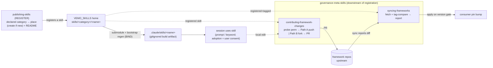

<p align="center">
  <strong>🇨🇳 中文</strong> | <a href="README.md">🇬🇧 English</a>
</p>

<p align="center">
  
</p>

<h1 align="center">VEMO_SKILLS · 共享 Skill 主仓</h1>

<p align="center">
  <strong>面向公开使用的可复用 agent skill 主仓——克隆、绑定、用提示词调用。</strong>
</p>

<p align="center">
  <a href="LICENSE"></a>
  <a href="VERSION"></a>
  <a href="skills"></a>
  <a href="eval/out/report.json"></a>
  <a href="CHANGELOG.md"></a>
</p>

<p align="center">
  
</p>

## 第一性 — 这个家为何存在

**防什么。** 防 skill 从两头烂掉：一头是副本跟源头越走越远，一头是项目自己的取值渗进了共享的主体。VEMO_SKILLS 让每个 skill
只有一个源头，重新生成的副本没法偏离它，而且通用主体里不掺任何项目事实。

**落实哪些原则**（这个家是**共享机制**，不是承门、也不自己记治理状态的框架——所以生态四公理有两条在这儿**用不上**；见框架0 `charter_spec`）：
- **通用归通用，项目归项目（A3 — 主）** — skill 主体和通用规则在这里存一份；**不写死任何项目取值**（id、路径、会话、语言都放在
  消费方实例里、运行时再读）；主体里要是嵌了项目取值，就是一处解耦缺口，由身份解耦自检逮出来。这正是这个家要守的那条公理。
- **改不回来的事，人来拍板（A4）** — 一个 skill **绝不**会没经用户明确同意就进工具集；发布要过门（`skill_spec` §6——规则归框架0，这个家只实现发布机制）。
- **说做完不算，验过才算（A1）— 用不上：** 这个家**自己不承验收门**；一个 skill 对不对，是在它被*用*的地方、由消费项目的框架0 门来验，不在这里。
- **以文档记录为准（A2）— 用不上：** 这个家**自己不记任务记录、不存接续状态**；它的耐久记录就是版本化的源码加 CHANGELOG，由记这些记录的项目去消费。

**体系位置。** 它是七实体里的**共享 skill 家**——不是领域框架，而是每个消费项目重新生成 skill 时的唯一源头。作为共享机制，
它由消费方自己的治理框架和发布流程接管。它提供的东西——单一源头的主体、身份解耦、靠提示词触发的几个治理元 skill（`syncing-frameworks` /
`contributing-framework-changes` / `publishing-skills`）、`publishing-deliverables` 里的 R1–R32 样式和 entry-doc 规则，
还有框架式的版本管理——详见下文。

**不管什么（说清边界）。** 它**没有门、也不自己记治理状态**（上面 A1／A2 用不上）——那些是消费项目的框架0 的事。每个实体守规守到
什么程度、还差哪些，是消费项目用自己那份符合度矩阵盯着的；这份 README 讲的是设计上一个 A3 主家该是什么样，项目那份记实际还差多少。

## 两种读法
本 README 有两种读法：
- **独立使用**——克隆本仓、跑重新生成；三个治理元 skill 自成一体，立刻可用（凡示例里出现仓 URL 处，换成你自己的）。
  下文标注*"在受治理项目里"*的跨仓引用是**背景，不是前置条件**——独立使用本仓并不需要那些兄弟仓。
- **置于受治理项目内**——VEMO_SKILLS 与各治理框架仓一并以子模块引入；下文对 `skill_spec`、`Project_Init`、
  `team_bootstrap` 的引用会指向那些兄弟仓。它们在**被纳入完整受治理项目时**才存在，独立使用并不需要。

## 目的（Purpose）
为可复用 agent workflow 提供通用、由模板托管的 **skill 主体**。它是可复用 skill 的唯一来源；
消费方项目以子模块或 clone 方式引入并重新生成工作副本。与治理框架一样解耦：**通用机制与规则在这里；项目特定取值在业务仓
实例**（`project_profile.yaml`）里，运行时读取。面向为新项目接线的工程师，以及任何想用自然语言提示词同步或贡献治理框架的人。

## 快速上手（Quickstart）
- **引入**：把本仓作子模块引入项目 `.governance/VEMO_SKILLS`（按 commit/tag 锚定）；bootstrap 步骤会把每个 skill
  生成到 `.claude/skills/<name>/`（Claude Code 的发现根目录——一个被 gitignore 的构建产物）。唯一来源 = 本仓；
  切勿手改生成出来的副本。
- **调用 skill**：在任意会话里用自然语言触发（见下文 **用提示词调用**），或用该 skill 的关键词。
- **升级**：本仓发布新版后，消费方项目在用户版本门上升级版本钉（`syncing-frameworks`）。

## VEMO 式验证
VEMO_SKILLS 带着和 VEMO 一样的发布姿态：小 CLI、确定性自检、可执行 eval。

```bash
python3 bin/vemo-skills status
python3 bin/vemo-skills selfcheck
python3 bin/vemo-skills eval
python3 bin/vemo-skills score /path/to/another/skill-home
```

完整版本阈值是 **9.5/10**。评分器会检查目录一致性、frontmatter、命名、引用、重新生成绑定、版本发布、
公开文档、安全解耦、可执行验证和 attribution governance。可执行 eval 会把当前报告写到 `eval/out/report.json`。

## 可视化地图（Visual map）

<p align="center">
  
</p>

本仓刻意保持小而可读：30 个 skill 分布在五个功能类目里，每个 `SKILL.md` 都带自己的 frontmatter，
可选引用模块放在同目录 `references/` 下。

## 布局（Layout）
```
skills/<category>/<name>/         # 按功能类目（skill_spec §9）；类目在 SKILL.md frontmatter 声明
  SKILL.md                        # 通用主体——零硬编码项目取值；携带 `category:`
  references/                     # 通用引用模块（可选，如 readme-style、technical-report-style）
```
类目是 **声明即创建**（skill 声明自己的 `category`；发布时若属新类目就建好文件夹）——见 `CONVENTIONS.md`。
类目是功能分组，不是框架仓。
- `orchestration/` — 阶段、交付、提示流程和运营类 skill：`breaking-down-prds`、`designing-diagnostic-prompts`、`publishing-deliverables`、`visualizing-governance`、`rendering-html-eval-reports`、`attending-group-mentions`、`packaging-device-sdk-releases`。
- `governance/` — 跨框架的治理元 skill：`syncing-frameworks`、`governing-project-fleets`、`contributing-framework-changes`、`publishing-skills`、`announcing-skills`、`naming-skills`、`announcing-framework-releases`、`polishing-chinese-prose`、`authoring-skills-with-evals`。
- `research/` — research-solution skill：`challenging-assumptions`、`reviewing-decisions`、`structuring-solution-docs`。
- `code/` — 代码审查、运行时和发布类 skill：`reviewing-cpp-code`、`optimizing-cpp-performance`（各自携带共享的 `references/embedded-cpp-rules.md`，保持一致）、`selecting-mobile-gpu-convolutions`、`validating-on-device-inference`、`gating-tflite-op-envelopes`（携带 `references/envelope_gate.py`）、`bumping-library-versions`、`converting-pytorch-to-tflite`、`loading-model-checkpoints`、`evaluating-segmentation-models`、`quantizing-on-device-models`。
- `visualization/` — pipeline / 结果可视化 skill：`visualizing-processing-pipelines`（携带 `references/scripts/` 下的 numpy+opencv builder 与可直接运行的 `references/examples/` demo）。

## Skill 目录（Skill Catalog）
每个 skill 一整行——**类目**显式成列（不再只藏在路径前缀里），所以一个 skill *属于什么类别*、*做什么*、*何时用*、
*边界* 一处看全。**skill** 列保留 `` `<category>/<name>` `` 标识。触发关键词在下文 **用提示词调用 → 关键词触发**
子表（与目录分开以保表格可读）。（目录行格式是维护义务——见 `CONVENTIONS.md` §3。）

| 类目 | skill | 做什么 | 何时用 | 边界 |
|---|---|---|---|---|
| orchestration | `orchestration/breaking-down-prds` | 把 PRD 拆成受治理、可溯源的任务 | 在 kickoff / 重大功能把 PRD 变成可执行工作 | 创作辅助；不设门 |
| orchestration | `orchestration/designing-diagnostic-prompts` | 设计多轮诊断或导师提示词：先采集信息，再配置风格/深度、定位约束、产出计划并循环反馈 | 写 Human 3.0 式自我探索提示词、Mr. Ranedeer 式导师提示词、定制 GPT、教练流程或 onboarding 访谈 | 只负责提示词/流程设计；项目事实和验收门留在消费仓 |
| orchestration | `orchestration/publishing-deliverables` | 把交付物发布到团队 wiki 并通知评审（报告样式 R1–R32；中文文风走 `polishing-chinese-prose`） | 某阶段产出交付物要归档到 wiki | 遵循实例路由与通知；不硬编码 id |
| orchestration | `orchestration/visualizing-governance` | 渲染治理系统（mermaid / SVG / markmap HTML） | README 要治理图，或产出 onboarding 材料 | 只渲染、不创作；每个节点都可溯源 |
| orchestration | `orchestration/rendering-html-eval-reports` | 把算好的结果渲染成一份自含 HTML 报告（图 base64 内嵌、带 provenance 头）——评测型（逐类准确率对验收线、含弃判/拒识列的混淆矩阵、延迟分布、错例全收画廊）或训练实验型（实验阶梯、训练曲线、消融表、实测/推测标注、局限性） | 一次评测或一轮训练实验的结果要变成可分享的本地 HTML 工件 | 只渲染、不跑推理/不训练；评测型错例全收、判对抽样；按实例策略嵌去标识图、HTML 不入 git；发 wiki 找 `publishing-deliverables` |
| orchestration | `orchestration/attending-group-mentions` | 群值守：按游标拉 @bot 提及、分类（要报告/数据/状态/问题/越权决策）、能办的办（用 bot 身份发文件/链接；数字只从指名台账或报告里引、禁编造），回复必 @ 提问人、用实例策略的中文（走 `polishing-chinese-prose`）；决策类转 @ 用户 | 群里有人 @ 机器人、要按需回复时 | 反应式应答（只在被 @ 时回、且回提问人）；决策一律上报不擅答；群/身份/游标/词表/open_id 实例所有；主动外推找 `announcing-skills`／`publishing-deliverables` |
| orchestration | `orchestration/packaging-device-sdk-releases` | 把算法库打成可交付的手机 SDK 发布包：版本号由 `bumping-library-versions` 指派（按名引）、标准包结构（最小对外头 / 按 ABI 的 libs / 带许可标注的 models / RELEASE_NOTES / USAGE 使用说明 / 可编译的 examples/ 示例源 / THIRD_PARTY）、随包双报告（质量走 `rendering-html-eval-reports`、性能走 `validating-on-device-inference` + 内存系统差值法）、清单+sha+解包回验 | 一个已构建的算法库要打成带版本、可审计的手机 SDK 包 | 产物组装；组合版本 + 评测报告 + 上板验收三个 skill（自身管包结构/许可标注/内存差值法/发布校验）；USAGE 与示例照真实头文件写、禁发明接口；打包≠发布——对外发送由人/lead 拍板；库名/版本/平台/群实例所有 |
| governance | `governance/syncing-frameworks` | 报告锚定的框架子模块上游是否前进；在版本门上升级版本钉 | 会话开始，或要检查框架更新 | 只报告；应用 = 消费方版本门；从不自动 |
| governance | `governance/governing-project-fleets` | 操作 VEMO 的本机项目注册表、策略档位、就绪报告与预览优先接管 | 治理本机全部 Git 项目、扫描仓库、选择档位或安全铺开 VEMO | 发现只读；采纳/应用须用户同意；就绪不等于认证；不强制覆盖 |
| governance | `governance/contributing-framework-changes` | 开一个 PR，把本地框架改动带回其仓 | 要把本地框架改进推回上游 | 始终走 PR；身份与路径运行时解析；从不合并 |
| governance | `governance/publishing-skills` | 按声明类目把 skill 放进主仓并维护目录 | 在 VEMO_SKILLS 新增 / 移动 / 改名 skill | 只负责放置与注册；是否采纳仍由用户决定 |
| governance | `governance/announcing-skills` | 把新注册的 **skill** 以喜庆 Lark 卡片公告（上新表 + 可选 🏆 累计贡献排行榜，按实例开关） | 一次 skill-hub 发布新增 skill 后 | skill 上新通知；群/身份/仓库地址实例所有；贡献名册身份无关；排行榜由 include_leaderboard 控 |
| governance | `governance/naming-skills` | 按命名规范校验 skill 的 name 与 description（≤64 / 字符集 / 动名词 / 与父目录同名；desc 做什么+何时用+触发词） | 创作 / 改名 / 发布 skill，或审计主仓 | 只读校验器；报 pass/fail，不改名 |
| governance | `governance/announcing-framework-releases` | 把**框架**版本发布以 Lark 卡片公告（框架 / 旧→新版本 / 变更分类 / 消费方影响） | 框架发布 tag 落定且 push 核验后 | 框架更新通知（无排行榜）；发送前确认；群/维护者实例所有，仓库地址运行时解析 |
| governance | `governance/polishing-chinese-prose` | 中文文风的权威源——两段可检查规则（翻译腔 R14–R20 + 文牍腔 R33–R39）+ EN→zh 术语表 | 写/审中文交付物、审 README_zh 镜像通顺度，或 agent 用中文回复时 | 别的 skill 按名引为文风权威；翻译腔实例激活、文牍腔 agent 层 always-on |
| governance | `governance/authoring-skills-with-evals` | 用 skill-creator 式流程做 skill 的创作与评测改进（行为 eval、触发 eval、训练/测试集切分的描述调优） | 创作或修订 skill，或描述触发不准（漏触发/误触发）时 | 拥有 eval 环节；与 naming-skills、publishing-skills 互补；只校验与调优，不采纳 |
| research | `research/challenging-assumptions` | 对抗式设计伙伴——挑战假设、套用思维模型 | 思考一个模糊 / 高风险决策时 | 只作咨询；不产出交付物 |
| research | `research/reviewing-decisions` | 审查决策记录（MADR）是否完整（6 字段底线 + 跨模型红队） | research-solution agent 定稿 solution_document 时 | 只作咨询 |
| research | `research/structuring-solution-docs` | arc42 风格的方案文档脚手架（结构即可校验规则） | 调研后撰写方案 / 设计文档时 | 结构辅助 |
| code | `code/reviewing-cpp-code` | 审查 C/C++ 编码规范与编译告警风险；挂载编码规范时以规范为权威逐条审 | 提交前要检查某段 C/C++ | 只读分析；只报告、不改代码 |
| code | `code/optimizing-cpp-performance` | 为 C/C++ 热点路径提出 cache / NEON / 多线程（**CPU**）优化方案 | 某热点 C/C++ 例程需要优化方案 | 只读分析；给出代码、不改代码 |
| code | `code/selecting-mobile-gpu-convolutions` | 用三条实测启发式（首帧∝kernel 数、预热∝算术强度、稳态∝FLOPs÷利用率）选标准 vs 可分离卷积，面向移动 **GPU** | 为移动 GPU 模型选卷积结构时 | 只读咨询；规律来自单一项目——须上板验证；CPU 热点优化见 `optimizing-cpp-performance` |
| code | `code/validating-on-device-inference` | 在真机上验收转换后的模型：推包→跑→收结果和日志，**先**判 host↔device 数值一致性（逐元素容差+argmax；低精度预算用 softmax/决策距离而非裸 logit；金丝雀余量=margin÷设备偏差），**再**采性能（预热与计时轮分离、延迟报分布并标注测试平台、delegate 开关各测且数值复验、功耗只作标注代理；替测平台弱于目标时保守外推——过门=方向性通过、不过门=不判死、余量薄须打折扣并标「目标平台须实测」） | 转换后的模型要在目标硬件上签收 | 方法论清单；出 PASS/FAIL 行、只读只测；设备/模型/阈值全部由调用方读入；静态包络门是上板前检查、本 skill 是设备运行期检查 |
| code | `code/gating-tflite-op-envelopes` | 静态把 `.tflite`/`.task` 对调用方给的**运行时包络**核对（解 flatbuffer 查自定义算子 + `min_runtime_version`，不加载运行时）；逐包络出 PASS/REJECT 并列出违规算子/版本 | 采纳某候选模型前为某运行时筛查 / 记模型卡运行时判定 | 只读模型；版本未知则保守判失败，零算子解析拒绝盖章（退出码 2）；包络版本为调用方入参 |
| code | `code/bumping-library-versions` | 验收通过后升库四段版本号 `X.Y.Z.W`：末位=修 bug +1 / 倒二=加特性 +1（清末位）/ 双事并发=倒二+1（清末位）/ 前两段人裁；保持版本号单源、三处一致（源码常量 / 初始化日志 / `getVersion()`）；升完显式报「旧→新」 | 发库版本要往前升时 | 只在验收构建+运行通过后才升；前两段绝不自动升；版本字段名/文件由调用方指定；自身管版本规则、`packaging-device-sdk-releases` 按名引用；**code 类目首个写动作 skill——只写版本常量/日志行这一处、不碰任何逻辑（显式标注的例外）** |
| code | `code/converting-pytorch-to-tflite` | 把 PyTorch/ONNX checkpoint 导成数值一致的手机 TFLite（fp16 / int8-hybrid），并把相机色彩变换（YUV/BGR）折进第一层卷积 | 导模型上端侧，或转换后输出与 PyTorch 参考漂移时 | 方法论 + 数值一致闸；驱动转换器、不自带；静态门 = gating-tflite-op-envelopes，上板签收 = validating-on-device-inference |
| code | `code/loading-model-checkpoints` | 当 state_dict 嵌套 / 前缀 / 架构 / 输入通道不确定时稳健加载 PyTorch checkpoint（按最大 key 重叠选前缀、打印 missing/unexpected） | checkpoint 加载到随机权重、或报 key 不匹配时 | 只读/实例化；标注 weights_only 安全注意；不训练/调参 |
| code | `code/evaluating-segmentation-models` | 用对的指标评测分割/抠图：mask 用 IoU/mIoU + 边界 F，抠图用 trimap 未知带内的 SAD/MSE/Grad/Conn，分类别、看边缘 | 分割/抠图模型签收、比 checkpoint、或核查转换/量化后的模型 | 只读/测量、出 PASS/FAIL；渲染 = rendering-html-eval-reports；上板 = validating-on-device-inference |
| code | `code/quantizing-on-device-models` | 为手机/NPU 沿阶梯量化（fp16 -> int8 动态 -> full-int8 PTQ -> QAT）；逐通道 + 输入非对称、敏感层留 float、按精度-时延预算过门 | fp16 端上太慢/太大、要做 INT8、选校准集、或量化后精度回退时 | 规划 + 验证（决策空间一致而非裸 logit）；驱动转换器、不自带 |
| visualization | `visualization/visualizing-processing-pipelines` | 把多步处理 pipeline（图像 / 数据 / ML）渲成一份自含 HTML 报告——逐步骤前后拖拽对比滑块、差异热力图、内联 base64 图、what/why/formula 注解、耗时条、pass/fail 指标；携带一个 pipeline 无关的 numpy+opencv builder，可出静态 `.html` 或交互式参数滑块服务 | 要可视化 / 讲解 / 调试 / 归档 / 演示一条图像 / 数据 / ML pipeline；前后对比滑块；算法逐步图解或参数调试 playground；把散落的中间结果汇成一份可分享文件 | 渲染/讲解辅助——由你驱动 builder、它不替你跑 pipeline；对比与差异图需同尺寸 BGR-uint8 对；base64 内联故大图须降采样（`display_width`）；与 `rendering-html-eval-reports`（评测/训练指标）不同——本 skill 讲解 pipeline 各步骤 |

## 治理图（Governance diagram）
一个 skill 如何从本仓流入消费方项目，治理元 skill 又如何把版本搬进搬出。生命周期是有序的：
**注册 → 绑定 → 同步 / 贡献**——`publishing-skills`（注册）是前提；未注册的 skill 对 sync 和 contribute 都不可见。
（只渲染、不创作；`visualizing-governance` 从规格重新生成此图。）


## 上手准备——先装上元 skill（Getting started）
下文 **用提示词调用** 里的提示词，假设元 skill（`syncing-frameworks`、`contributing-framework-changes`、`publishing-skills`）已经
**绑定**进你的项目。它们不预装——也没有单独的安装器：**元 skill 本身就是本仓里注册的 skill**（`skills/governance/`），
所以获取本仓再跑一次重新生成，*就是*获取了这套维护工具链。首次获取路径（任意消费方、任意组织）：

1. **引入本仓**，作子模块并锚定到一个发布 tag（或直接克隆）：
   `git submodule add <this-repo-url> .governance/VEMO_SKILLS`，再锚定到 tag（`git -C .governance/VEMO_SKILLS checkout v<X.Y.Z>`）。
   *（在完整受治理项目里，这是 starter 的 `Project_Init` 第 1 步——框架与 VEMO_SKILLS 一并引入；该步在受治理项目里才有，
   独立使用并不需要。）*
2. **跑 bootstrap 重新生成**——把 **每个注册的 skill**（含三个元 skill）生成到 `.claude/skills/<name>/`
   （Claude Code 的发现根；一个被 gitignore 的构建产物，唯一来源 = 本仓）。
   *（在受治理项目里这是 `Project_Init` 第 2 步 / 业务仓的 team-bootstrap 流程；独立使用不需要。重新生成会逐个复制
   `skills/<category>/<name>/` **整个文件夹**——它的 `SKILL.md` **以及** 任何 `references/`——并把 category 这一层抹平；
   元 skill 不作特殊处理——绑定像对待其它注册 skill 一样把它们一并涵盖。）* **独立消费、没有受治理项目的 bootstrap？
   见下文 [用 LLM 引导安装](#bootstrap-via-llm-zh)，那里有完整的重新生成规则和一段可直接复制的提示词。**
3. **现在提示词就能触发了。** 第 2 步跑之前，下文提示词解析为空——skill 还没落到磁盘上。这是生命周期的绑定阶段
   （`CONVENTIONS.md` §0：注册 → **绑定** → 同步 / 贡献）；获取加重新生成绑定了元 skill，此后它们就能去同步、贡献其余 skill。

这条路径是**身份解耦**的：以上没有任何地方写死组织、账号或项目——换成你自己的仓 URL，对任意消费方都成立。

<a id="bootstrap-via-llm-zh"></a>
### 用 LLM 引导安装（Bootstrap via LLM）
独立消费方没有 `Project_Init` / team-bootstrap 替它跑第 2 步。把下面这段提示词交给你的 LLM（Claude Code 或任何有
shell 与文件权限的 agent），它会零配置地把安装一气做完。**把 `<this-repo-url>` 换成你自己的仓 URL**；提示词不写死任何
组织、账号或项目。

提示词依赖的**重新生成规则**（只在此处声明一次——本节即唯一来源）：
- 逐个把 `skills/<category>/<name>/` **整个文件夹**复制到 `.claude/skills/<name>/`，并把 `<category>` 这一层**抹平**。
- **要带上 `references/`。** 一个引用模块只有待在它所属 skill 文件夹**内部**才能存活——重新生成会丢掉 category 目录，
  因此放在 category 这一层的共享 `references/` 不会被生成，它的引用在运行时就会悬空。
- `.claude/skills/` 是一个**被 gitignore 的构建产物**（唯一来源 = 本仓）；切勿手改生成出来的副本。
- **元 skill 不作特殊处理**——像绑定其它注册 skill 一样绑定它们。

```text
Install the VEMO_SKILLS skill hub into this project, end-to-end:

1. Attach the hub as a submodule pinned to a release tag (or clone it):
     git submodule add <this-repo-url> .governance/VEMO_SKILLS
     git -C .governance/VEMO_SKILLS checkout v<X.Y.Z>     # the release tag you want
2. Regenerate working copies for Claude Code discovery. For EVERY skill folder
   .governance/VEMO_SKILLS/skills/<category>/<name>/ :
     - copy the WHOLE folder — SKILL.md AND any references/ subfolder —
       to .claude/skills/<name>/  (flatten the <category> level; do not keep it)
     - do not special-case the governance/ meta skills; treat them like any other
   Treat .claude/skills/ as a gitignored build artifact (single source = the hub);
   never hand-edit the regenerated copies.
3. Verify the bind: for each <name> under .claude/skills/, confirm SKILL.md is present
   AND — if the source skill had a references/ — that .claude/skills/<name>/references/
   exists with the same files (a reference module that did not land will dangle at runtime).
   Report any skill whose references/ is missing.
```

提示词跑完后，下文 **用提示词调用** 里的自然语言触发就会生效——元 skill 已绑定，可以去同步、贡献其余 skill。

## 用提示词调用（Use via Prompt）
治理元 skill 由自然语言触发，且**零配置、零身份**：把提示词逐字复制即可——它们不假设你的账号、组织或仓。身份、上游与权限
都在运行时解析（`git remote get-url` / `gh api user` / 一次实时 `permissions.push` 探测）。（还没装？见上文 **上手准备**——
元 skill 必须先绑定进 `.claude/skills/`。）

**顺序要紧：注册 → 同步 → 贡献。** 一个 skill 必须先**注册**进主仓（`publishing-skills`），才谈得上同步或贡献——
`syncing-frameworks` 比较的是已发布（= 已注册并打过 tag）的版本，`contributing-framework-changes` 提交的是已注册的 skill，因此
未注册的 skill 对两者都不可见。下列提示词按这个生命周期顺序排列。

### 发布一个 skill——归类并注册（作者 / scout）——前提
> "发布一个 skill" · "把这个 skill 归类" · "publish a skill" · "add a skill to VEMO_SKILLS"

`publishing-skills` 读取 skill 声明的 `category`（frontmatter），把它放到 `skills/<category>/<name>/`——
**若属新类目就建好文件夹**（声明即创建）——再更新 README（Skill 目录、布局、用提示词调用）并校验重新生成。
**这一步就是注册**——下面两步的前提。它只治理**放置与注册**：一个 skill *进入项目工具集*（采纳）仍由**用户决定**
（Skill Scout 提议 → 用户同意 → 发布执行）。

### 同步——检查上游（只读；谁都能跑）
> "检查一下治理框架上游有没有新版本" · "sync 一下治理框架" · "check framework updates"

`syncing-frameworks` 拉取每个锚定的框架子模块，把锚定的 tag 与最新上游 tag 相比，并**报告**差异（一张
仓 / 锚定 / 上游 / 落后多少 的表）。它**不需要写权限**——报告这条路对任何只读用户都走得通。**应用**一次版本钉升级
（迁移到更新的治理规则）则留给消费方**自己的用户版本门**；这个 skill 从不自动升级。

### 治理本机项目群——盘点、档位与安全采纳
> "治理本机所有项目" · "扫描本地 Git 仓库" · "PC-wide VEMO rollout" · "fleet readiness report"

`governing-project-fleets` 按一条明示流程操作 VEMO 的本机私有控制面：只读发现 → 选择档位 → 用户同意后注册 →
评估就绪度 → 接管预览 → 明示应用 → 审计链核验。它不把“发现”偷换成“采纳”，不强制覆盖项目自有文件，也不把本机就绪度
包装成认证或远端源码/构建平台的权威结论。

### 贡献 / PR——把框架改进推回上游（任何贡献者）
> "把我对 xxx_spec 的改进 PR 回上游" · "贡献回上游框架" · "contribute this framework change" · "open a framework PR"

`contributing-framework-changes` 探测你对目标仓的写权限，再走对应的**对等**路径——**无需配置，两条路都不算降级**：
- **路径 A（你有 push 权限）** → 把一个 `contrib/*` 分支推到该仓，开一个**仓内 PR**。
- **路径 B（你没有）** → 用 `gh repo fork` 派生该仓，推到你的 fork，开一个**跨仓 PR**。

无论哪条，你都会得到一个针对框架默认分支的 PR。外部贡献者向自己并不拥有的框架发 PR，是**头等情形**，
不是边角回退——复制提示词即可。

### 公告——为新注册的 skill 庆祝（发布后通知）
> "公告一下新 skill" · "announce the new skills" · "发上新公告" · "skill 上新通知"

`announcing-skills` 在一次发布新增 skill 后，向团队群推送一张喜庆的 Lark **交互卡片**：一张上新表（主仓版本 · 类目 ·
简介 · @ 贡献人）外加一张**可选**的 **🏆 累计贡献排行榜**，从主仓**身份无关**的 `contributors.yaml` 贡献名册算出——仅当
实例开了 `include_leaderboard` 且贡献人→open_id 映射非空时才出，否则整节跳过（不报错）。**发布后**运行（在
`publishing-skills` 注册完之后）。群、发送身份、仓库地址、排行榜开关，以及贡献人→open_id 映射都由**实例所有**
（`skill_hub.announce`）；这份名册由主仓所有且身份无关。用卡片承载真实表格——其 `<at>` 语法与 post 不同（见该 skill
的 `references/card-format.md`）。

### 命名 / 校验 skill——命名门（创作 / 发布 / 审计）
> "校验 skill 命名" · "name a skill" · "check skill naming" · "skill 命名校验" · "audit naming"

`naming-skills` 按命名规范校验 skill 的 `name` 与 `description`——`name` ≤64 字符、仅小写字母/数字/连字符、不以连字符
首尾、**动名词（verb+ing）**形式、且与父目录同名；`description` 非空、≤1024 字符、说明做什么+何时用并含触发词。它是
`publishing-skills` 在注册前调用的**权威命名门**，也可由作者或主仓审计独立运行。**只读**——逐条报 pass/fail，不改名。

### 公告框架版本发布——版本更新通知（tag 核验后）
> "公告框架版本更新" · "announce framework release" · "发框架升级公告" · "框架版本公告"

`announcing-framework-releases` 在某治理框架完成已核验的发布后，向团队群推送 Lark **交互卡片**：框架名+代号、旧→新版本、
从其 CHANGELOG 提取的**变更分类摘要**（Added / Changed / ⚠️ BREAKING）、一句**确定性消费方影响判定**（含 ⚠️ BREAKING 标记或
主版本跳变→破坏性，否则向后兼容）、仓库/CHANGELOG 链接 + 维护者，外加一张**可选 🏆 贡献排行榜**——与 `announcing-skills`
**同一块**，从**同一份**主仓 `contributors.yaml` 算出、由 `framework_announce.include_leaderboard` 控（用户裁定
2026-06-11：贡献在哪公告就在哪露脸）。群+维护者 open_id 实例所有（`framework_announce`）；排行榜的贡献人映射复用
`skill_hub.announce`（单一来源）；仓库地址运行时从 submodule remote 解析。**发布后**运行（tag 落定且 push 核验后）；
对外发送前确认。

### 渲染评测或训练实验报告——自含 HTML 工件（任意模型 / 数据集）
> 评测："出 HTML 评测报告" · "render the eval report" · "评测结果生成网页报告" · "self-contained eval HTML"
> 训练实验："出训练实验报告" · "render the training-experiment report" · "训练实验/消融生成网页报告" · "ablation report HTML"

`rendering-html-eval-reports` 把**算好的**结果变成**一份自含 HTML 文件**，分两种报告型。**评测型**渲染 provenance 头
（数据版本 / 模型 sha / runtime / 日期）、逐类准确率表对照验收线、含**弃判/拒识列**的混淆矩阵、样例画廊（**错例全收**带
预测标签和叠绘、判对抽样），以及带 caveat 的延迟分布。**训练实验 / 消融型**渲染实验阶梯表（每轮：变量 / 假设 / 结果 / 裁定）、
内嵌 base64 训练曲线、消融对照表、**每个数标注实测还是推测**，以及聚成一节的局限性。每张图 base64 内嵌，整份报告是单一
可携带工件。**只渲染**：消费算好的结果，**不**跑推理、不训练、不算指标。类集、验收线、caveat 文本、阶梯/消融取值、隐私策略
都是**实例取值**（解耦，`skill_spec` §9）；图按实例策略嵌去标识版，HTML 是本地工件、**不入 git**。与 `publishing-deliverables`
（把文档发到团队 wiki）不同——两者可组合，但是不同功能。

### 用 eval 写 skill：eval 驱动的创作（创建 / 修订 / 调触发）
> "建一个带 eval 的 skill" · "author a skill with evals" · "skill 描述不触发" · "优化 skill 描述"

`authoring-skills-with-evals` 跑一套 eval 驱动的创作流程（取自 Anthropic 官方 skill-creator，适配本主仓）：先 **lint**
形态（`validate` 写出带诚实 `tier` 的 `.skill-validated.json`），再 **测触发**（`trigger-eval`，三态；基础设施故障记为
*skipped*，绝不误判成"没触发"），最后用**训练/测试集切分**优化描述以防过拟合（`describe-improve`）。行为层与静态发布评分器
互补；一个 skill 只有两层都过才算完成。两个依赖模型的命令需要 `claude` CLI，缺失时干净跳过。

### 关键词触发（中英对照）
上文 **Skill 目录** 的触发词子表——每个提示词触发 skill 的调用关键词（中英对照）。
| skill | 中文 | English |
|---|---|---|
| `syncing-frameworks` | 检查框架更新 · 同步框架 · 框架版本 | check framework updates · sync frameworks · framework version |
| `governing-project-fleets` | 治理本机所有项目 · 扫描本地仓库 · 项目治理档位 · Fleet 就绪报告 | govern all PC projects · scan local repositories · project governance profiles · fleet readiness report |
| `contributing-framework-changes` | 贡献框架 · 推框架改动 · 贡献回上游 | contribute framework · framework PR · contribute back upstream |
| `publishing-skills` | 发布 skill · 归类 skill · 新增 skill | publish a skill · categorize a skill · add a skill |
| `announcing-skills` | skill 上新公告 · 公告新 skill · 上新通知 | announce new skills · skill release announcement |
| `announcing-framework-releases` | 公告框架版本更新 · 框架版本公告 · 发框架升级公告 | announce framework release · framework version update · framework release announcement |
| `naming-skills` | 校验 skill 命名 · skill 命名校验 · 命名规范检查 | name a skill · check skill naming · audit naming |
| `authoring-skills-with-evals` | 建带 eval 的 skill · eval 驱动写 skill · skill 描述不触发 · 优化 skill 描述 | author a skill with evals · eval-driven skill authoring · description not triggering · improve skill description |
| `designing-diagnostic-prompts` | 诊断提示词 · 人生顾问提示词 · 导师提示词 · 自我探索 prompt · 定制 GPT 流程 | diagnostic prompt · Human 3.0-style prompt · Mr. Ranedeer-style tutor · coaching prompt · custom GPT flow |
| `reviewing-cpp-code` | C/C++ 代码检查 · 代码规范审查 | C/C++ code review · coding-standard check |
| `optimizing-cpp-performance` | C/C++ 性能优化 · NEON 向量化 · cache 优化 | C/C++ perf optimize · NEON vectorize · cache optimization |
| `selecting-mobile-gpu-convolutions` | 标准卷积还是可分离 · 移动 GPU 卷积选型 · 端侧卷积选择 | mobile GPU conv selection · standard vs separable conv · on-device conv choice |
| `validating-on-device-inference` | 上板测试 · 真机验收 · host↔device 一致性 · 设备端签收 · 延迟 p50/p90 | on-device validation · device sign-off · host↔device parity · on-device latency · delegate re-verify |
| `gating-tflite-op-envelopes` | 过一下运行时包络 · 静态算子包络核对 · tflite 自定义算子检查 | runtime envelope gate · check tflite custom ops · screen .tflite/.task for adoption |
| `bumping-library-versions` | 升库版本号 · 改版本号 · 发版升号 · 四段版本号 | bump library version · version bump after acceptance · four-segment version |
| `converting-pytorch-to-tflite` | 导出 tflite · pytorch/onnx 转 tflite · 端侧模型转换 · YUV/BGR 色彩折叠 · tflite 输出不一致 | export to tflite · pytorch/onnx to tflite · convert model for mobile · YUV/BGR colour fold · tflite output mismatch |
| `loading-model-checkpoints` | 加载 checkpoint · state_dict 不匹配 · missing/unexpected keys · 去 module. 前缀 · 权重加载到随机 | load a checkpoint · state_dict mismatch · missing/unexpected keys · strip module. prefix · loaded onto random weights |
| `evaluating-segmentation-models` | 评测分割 · 抠图指标 · IoU/边界 F · SAD MSE Grad Conn · 逐类准确率 · 这个 mask 好不好 | evaluate segmentation · matting metrics · IoU/boundary F · SAD MSE Grad Conn · per-class accuracy · is this mask good |
| `quantizing-on-device-models` | 量化模型 · int8/PTQ/QAT · 代表集/校准 · 逐通道量化 · 量化后掉点 · fp16 还是 int8 | quantize model · int8/PTQ/QAT · representative/calibration set · per-channel quant · accuracy drop after quant · fp16 vs int8 |
| `polishing-chinese-prose` | 中文不通顺 · 不是人话 · 中文文风校验 · 润色中文 | polish Chinese prose · plain Chinese · Chinese style check · 文牍腔/翻译腔 |
| `rendering-html-eval-reports` | 出 HTML 评测报告 · 评测结果生成网页报告 · 自含评测报告 · 出训练实验报告 · 训练实验/消融生成网页报告 | render eval report · self-contained eval HTML · HTML eval report · render training-experiment report · ablation report HTML |
| `attending-group-mentions` | 群值守 · 值守群消息 · 回复群里的 @ · 群里有人 @ 机器人 | attend the group chat · answer @bot mentions · staff group chat |
| `packaging-device-sdk-releases` | 打 SDK 发布包 · 端侧 SDK 打包 · 出手机 SDK 发布 · SDK 版本号 + 发布包 | package the device SDK · assemble an SDK release · mobile SDK release package · SDK version + package |
| `visualizing-processing-pipelines` | 可视化 pipeline · 各步骤前后对比 · 对比滑块 · 算法图解 · 中间结果报告 · 参数调试 playground | visualize this pipeline · before/after per step · comparison slider · explain the algorithm with images · report of intermediate results · parameter-tuning playground |

## 业务仓如何消费本仓（How the business repo consumes this）
- `VEMO_SKILLS` 以子模块引入业务仓（按 commit 锚定，像框架仓一样版本化、打 tag）。
- bootstrap 步骤把工作副本重新生成进业务仓的 `.claude/skills/<name>/`（Claude Code 的发现根）。这些工作副本是
  **构建产物**——被 gitignore、从不纳入版本控制——所以无从漂移。
- 唯一来源 = 本仓。项目取值不放这里，放在业务仓实例里。

## 版本（Version）
- 见 [`VERSION`](VERSION) 与 [`CHANGELOG.md`](CHANGELOG.md)（发布版本都打了 git tag）。Semver，像框架仓一样
  PR 合并后打 tag（框架发布流程，在受治理项目里提供）。

## 许可（License）
- [MIT](LICENSE)。第三方借用（standard-readme、MADR、markmap、zh-style-guide、Microsoft/Google 样式指南、arc42）
  在 [`THIRD-PARTY-NOTICES.md`](THIRD-PARTY-NOTICES.md) 中标注；内置的 `challenging-assumptions` skill 保留自己独立作用域的 LICENSE。

> 治理规则：生态的 skill 通用/实例解耦规格（`skill_spec` §9——在受治理项目里提供；独立使用时，该规则在
> [`CONVENTIONS.md`](CONVENTIONS.md) 中有摘要）；entry-doc 样式见 **`readme-style.md` 的 R29+ entry-doc 族**（含 R32 双语对）。
> 主仓本地操作约定（类目布局、README 义务、重新生成、身份、产品式开头）：见 [`CONVENTIONS.md`](CONVENTIONS.md)。
