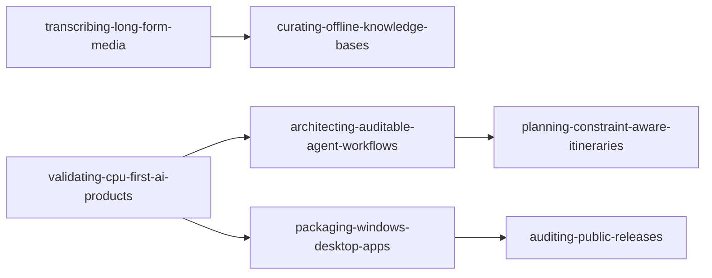

# Codex Project Skill Generalization Audit

Date: 2026-08-02

## Scope and method

The local Codex project registry contained nine active local Git workspaces. A read-only VEMO discovery across the
workspace roots found 63 Git repositories, including nested source caches, evaluation fixtures, temporary audit clones,
and product subrepositories. Those nested artifacts were treated as evidence, not as 63 independent project outcomes.

The audit reviewed project entry docs, agent instructions, task records, architecture and release documents, test
inventories, recent commits, and selected implementation/checker code. A workflow qualified for publication when it:

1. had a repeatable natural-language trigger;
2. had stable steps and a clear artifact/evidence contract;
3. was supported by completed implementation or test evidence;
4. could remove project paths, identities, thresholds, and proprietary data;
5. did not duplicate an existing skill's authority.

The first-principles decision rule was: reusable value equals repeat frequency times error-cost reduction times
non-obvious procedure times verifiability times portability, minus overlap and maintenance cost. A project outcome did
not become a skill merely because it was substantial.

## Reuse and share decision

| skill | unique authority | reuse decision | share tier |
|---|---|---|---|
| `curating-offline-knowledge-bases` | source ledger, honest completeness, source/concept separation, learning DAG, lexical-first retrieval | keep | stable candidate |
| `transcribing-long-form-media` | caption/ASR lineage, resumable timeline, critical-span and visual verification | keep; feeds knowledge curation | stable candidate |
| `architecting-auditable-agent-workflows` | LLM/deterministic/human decision rights, typed state, independent validation | keep as shared base | stable candidate |
| `planning-constraint-aware-itineraries` | IANA-timezone scheduling, travel constraints, protected one-day replan | keep as domain specialization; generic agent rules removed | specialized candidate |
| `validating-cpu-first-ai-products` | joint demand, device, quality, rights, privacy, and economics decision gate | keep at product-decision layer; conversion/deployment mechanics delegated | specialized candidate |
| `packaging-windows-desktop-apps` | PE/runtime packaging and hostile-clean Windows execution | keep as platform specialization; public audit delegated | specialized candidate |
| `auditing-public-releases` | read-only source/history/archive/CI/tag/remote release verification | keep; distinct from publishing authority | stable candidate |

No complete skill in this batch was redundant. Three partial overlaps were removed: generic agent rules from itinerary
planning, model implementation mechanics from CPU-first validation, and generic release governance from Windows
packaging.

## Validation evidence

- All 37 repository skills use standard YAML-compatible frontmatter and pass the system skill-creator quick validator
  when run under an explicit UTF-8 Python runtime.
- Repository validation passes all 37 skills; selfcheck scores 10.00/10 and executable conformance passes 13/13.
- Three context-isolated forward tests exercised the knowledge/media pair, agent/itinerary pair, and
  CPU/Windows/release chain without reading project repositories.
- The first CPU/Windows/release run invented a feature, platform floor, and sample/user counts. The product and package
  skills were tightened to return `needs-input` instead. A clean rerun preserved all unknowns, selected no arbitrary
  threshold, wrote no file, and returned `not-ready` until real evidence exists.
- Validation markers remain honestly `tier: lint`; model-trigger evaluation is still pending because the required
  `claude` CLI is unavailable. Forward tests demonstrate workflow composition, not automatic-trigger accuracy.

## Evidence map

| project capability | reusable evidence | generalized skill |
|---|---|---|
| Offline learning hub and personal knowledge repository | source ledger, A-E completeness model, topology, lexical index, manifest/hash/link checks, localhost UI | `research/curating-offline-knowledge-bases` |
| Multilingual subtitle and video-learning pipelines | caption-first acquisition, timestamped ASR, backend fallback, keyframes/OCR, checkpoint recovery, independent quality gates | `orchestration/transcribing-long-form-media` |
| Travel, investment, and governed automation products | typed tools, LLM/deterministic authority split, immutable versions, provider provenance, independent validators, fixture paths | `orchestration/architecting-auditable-agent-workflows` |
| Constraint-aware travel planner | IANA timezones, hard/soft constraints, real transit/buffer items, locked local replan, export round-trip tests | `orchestration/planning-constraint-aware-itineraries` |
| Local portrait effects product | demand gate, licensed failure-oriented test set, CPU/browser placement matrix, versioned recipes, golden cases, unit economics, Go/Narrow/Stop | `research/validating-cpu-first-ai-products` |
| Video downloader, portrait planner, and subtitle desktop releases | isolated Windows builds, runtime doctor, executable metadata, portable archive, manifests, clean-path smoke tests | `code/packaging-windows-desktop-apps` |
| Public portfolio and three desktop/software releases | tracked/archive/history privacy scans, allowlists, manifest parity, pinned CI, tag identity, downloaded artifact re-scan | `governance/auditing-public-releases` |

## Existing skills reused instead of duplicated

- C/C++ review, mobile inference, TFLite conversion, segmentation evaluation, and quantization already had dedicated
  code skills, so the CPU-first skill composes with them rather than restating model-lifecycle mechanics.
- PR decomposition, decision review, solution-document structure, and HTML evaluation rendering already had owners.
- PC-wide discovery/readiness is already owned by `governing-project-fleets`; this audit did not create another fleet
  scanner or register discovered repositories.

## Deferred candidates

| candidate | reason not published in this batch | evidence needed next |
|---|---|---|
| building role-specific interview curricula | strong implementation, but current flow mixes personal resume facts, live job pages, and source-specific educational licenses | parameterized profile/JD schema plus a second independent role family and copyright-safe fixtures |
| planning commercial photo shoots | released product, but the reusable camera/location/model/usage-rights schema has only one product lineage | reuse on a second shoot type and validate call-sheet/PDF contracts independently |
| operating personal investment research | good freshness, thesis-version, and risk-gate design, but commercial use crosses jurisdiction-specific financial-advice and data-license boundaries | legal/product boundary profile and non-advisory benchmark fixtures |
| producing personal-brand portfolios | useful public/private split and evidence-led writing, but positioning remains identity-specific and overlaps general frontend/document skills | two additional portfolio archetypes and a generic evidence schema |
| running controlled product-learning experiments | strong protocol in the code-explainer project and related product gates, but not yet repeated as one independent reusable harness | a second pre-registered experiment with deterministic compiler and preserved negative evidence |
| downloading web media | mature downloader exists, but platform, copyright, and authorization rules vary too much for a generic download skill | explicit authorized-source profiles and a compliance-first test matrix |

## Reuse topology

`curating-offline-knowledge-bases` owns the durable learning model; media transcription feeds it. The agent workflow
skill owns generic authority/state/provenance rules; itinerary planning is a domain specialization. CPU-first validation
decides whether a product path deserves implementation and packaging. Windows packaging produces the artifact; the
public-release audit independently checks source, archive, CI, tag, and remote output.

## Audit boundary

This was a source-and-workflow generalization audit, not a security scan and not a claim that every historical Codex
turn was semantically reviewed. Chat/project metadata and local paths were used only to locate evidence; no task ID,
account name, credential, local path, or private content was copied into a shared skill body.
